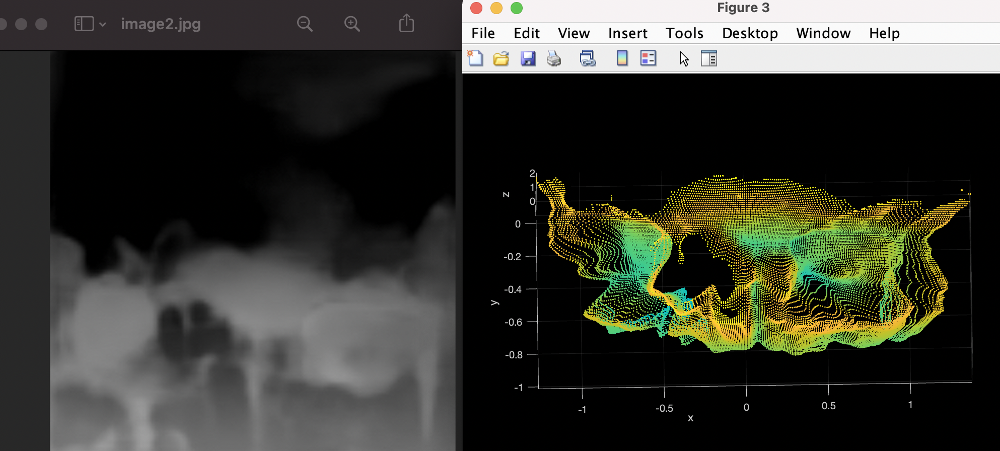

# FastDepth Model Variant
### By: Neel Dhulipala, Mario Gergis, and Merwan Yeditha

__This branch contains Firebase implementatino & Data logging__
An implementation of the FCRN CoreML library created by [tucan9389](https://github.com/tucan9389/DepthPrediction-CoreML) and adapted by [JustinFincher.](https://github.com/JustinFincher/FastDepth-CoreML)

This app displays the live camera output and a heatmap produced by a matrix of distances computed by the FCRN neural network. The network takes the camera output as an input and, using the CoreML library (see below), estimates the distance between every point in the image and the camera. Our additions to this app include:

- Generating point clouds based on these approximated distances
- Updating code from using UIKit to SwiftUI

*Figure 1: Rendering a point cloud based on an image taken from the app*

This app also has Google Firebase connectivity, which uploads data from the app such as camera input, the depth heatmap, any pointcloud data, mesh data, and detected planes onto a backend server called the Clew Sandbox. These meshes can be built to map out a space. Figure 2 shows a map of two floors of the academic center where this research is being held. Currently, research is being held as to how this data can be used for training a neural network that can be helpful for the Clew app or other accessibility resources.

*Figure 2: Hallways of Olin's Miller Academic Center. The path was a loop, which started on the first floor and involved ascending and descending the flights of stairs that can be seen in the mesh.*

For more information on how this app works and how to utilize certain features, see the [Depth Viewer Wiki](https://github.com/occamLab/DepthPrediction/wiki).

[mlmodel download](https://drive.google.com/file/d/16NV8gUvvrlmhgFT9hrrEkAetp-BAKGlG/view?usp=sharing)
